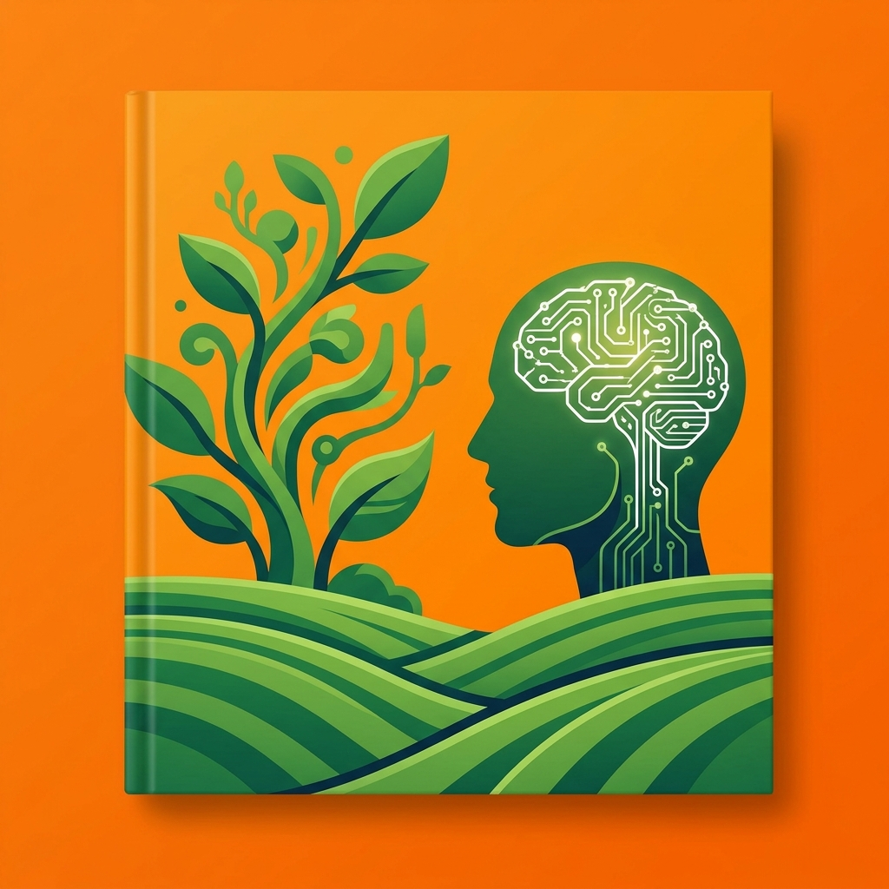

---
pdf_options:
  format: A4
  displayHeaderFooter: true
  headerTemplate: |
    <div style="font-family: 'Sarabun', sans-serif; font-size: 9px; width: 100%; margin: 0 1.0in 0 1.5in; padding-top: 1.5cm; display: flex; justify-content: space-between; border-bottom: 0.5px solid #ddd; padding-bottom: 2px; box-sizing: border-box;">
      <span style="color: #666;">Python xAI &lt; AI-AGENT Co-Creator &gt;</span>
      <span style="color: #333; font-weight: bold;"><span class="pageNumber"></span></span>
    </div>
  footerTemplate: |
    <div style="font-family: 'Sarabun', sans-serif; font-size: 9px; width: 100%; margin: 0 1.0in 0 1.5in; padding-bottom: 1.5cm; display: flex; justify-content: center; border-top: 0.5px solid #ddd; padding-top: 2px; box-sizing: border-box;">
      <span style="color: #888;">หลักสูตรเทคโนโลยีดิจิทัลปัญญาประดิษฐ์เพื่อการเกษตรและสิ่งแวดล้อม 2570</span>
    </div>
  margin:
    top: 3cm
    bottom: 3cm
    left: 1.5in
    right: 1in
---

<style>
@import url('https://fonts.googleapis.com/css2?family=Sarabun:wght@300;400;500;700&display=swap');
body {
    font-family: 'Sarabun', sans-serif;
    line-height: 1.6;
    color: #333;
}
h1 {
    page-break-before: always;
    color: #222;
    border-bottom: 3px solid #222;
    padding-bottom: 10px;
    margin-top: 0;
}
h1:first-of-type {
    page-break-before: auto;
}
.cover-page h1 {
    page-break-before: auto !important;
}
h2 {
    color: #444;
    margin-top: 1.5em;
    border-bottom: 1px dashed #ccc;
    padding-bottom: 10px;
}
h3 {
    color: #333;
}
table {
    width: 100%;
    border-collapse: collapse;
    margin: 20px 0;
}
th, td {
    border: 1px solid #ddd;
    padding: 12px;
    text-align: left;
}
th {
    background-color: #f2f2f2;
    color: #444;
}
blockquote {
    border-left: 5px solid #ccc;
    background-color: #fefefe;
    padding: 10px 20px;
    margin: 20px 0;
}
code {
    background-color: #f9f9f9;
    padding: 2px 5px;
    border-radius: 4px;
    color: #d84315;
    font-size: 0.9em;
}
pre { 
    background-color: #fcfcfc; 
    color: #333333; 
    padding: 12px 5px 5px 5px; 
    font-size: 0.6em; 
    margin: 10px 0; 
    line-height: 1.2; 
    border: 1px solid #e0e0e0; 
    border-radius: 6px; 
    overflow-x: auto; 
    page-break-inside: avoid; 
    position: relative;
    box-shadow: inset 0 0 5px rgba(0,0,0,0.02);
}
pre::before {
    content: ".py / .ipynb";
    position: absolute;
    top: 0;
    right: 0;
    background-color: #f0f0f0;
    color: #999;
    padding: 2px 6px;
    font-size: 0.85em;
    font-weight: bold;
    border-bottom-left-radius: 6px;
    border-top-right-radius: 5px;
    border-left: 1px solid #e0e0e0;
    border-bottom: 1px solid #e0e0e0;
}
pre:has(.language-python)::before {
    content: "🐍 .py / .ipynb";
    color: #888;
    background-color: #f2f2f2;
    border-color: #c8e6c9;
}
pre:has(.language-bash)::before, pre:has(.language-sh)::before {
    content: "💻 Terminal";
}
pre code {
    background-color: transparent;
    color: inherit;
    padding: 0;
}

/* --- Academic Layout Styles --- */
h1 {
    page-break-before: always;
}
/* Named page for chapters to hide headers/footers */
.chapter-page {
    page: chapter;
    margin-top: 2in; /* Large space for the title on first page of chapter */
}

@page chapter {
    margin-top: 0;
    margin-bottom: 0;
    /* This effectively hides the Puppeteer header/footer which are printed in margins */
}

h1.chapter {
    padding-top: 2.5cm;
    text-align: center;
    border-bottom: 2.5cm solid var(--primary);
    margin-bottom: 2.5cm;
}

/* --- Academic Header/Footer Hiding Strategy --- */
@page chapter {
    margin-top: 0 !important;
    margin-bottom: 0 !important;
}

h1.chapter {
    page: chapter;
    page-break-before: always;
    padding-top: 2in;
    text-align: center;
    color: #888;
    border-bottom: 3px solid #222;
    margin-bottom: 2.5cm;
}

</style>
<style>
@page {
    margin: 1in 1in 1in 1.5in; /* Top, Right, Bottom, Left (1.5 for binding) */
}
@page :first {
    margin: 0; /* Cover remains full page */
}

.agentic-cover {
    height: 100vh;
    width: 100vw;
    background: #f48e21; /* Bright Orange */
    padding: 25px;
    box-sizing: border-box;
    display: flex;
    justify-content: center;
    align-items: center;
    font-family: 'Outfit', 'Sarabun', sans-serif;
}
.inner-frame {
    width: 100%;
    height: 100%;
    background: #003d2b; /* Dark Green */
    border-radius: 60px;
    padding: 60px 40px;
    box-sizing: border-box;
    display: flex;
    flex-direction: column;
    align-items: center;
    text-align: center;
    color: white;
    position: relative;
    overflow: hidden;
}
.cover-title {
    font-size: 6rem;
    font-weight: 800;
    margin: 0;
    line-height: 1;
    letter-spacing: -3px;
}
.cover-subtitle {
    font-size: 2.2rem;
    color: #ffd54f; /* Yellow */
    font-weight: 700;
    margin-top: 2.5cm;
    letter-spacing: 2px;
}
.cover-desc {
    font-size: 1.1rem;
    color: #e0f2f1;
    margin-top: 2.5cm;
    opacity: 0.8;
}
.art-container {
    flex: 1;
    display: flex;
    align-items: center;
    justify-content: center;
    width: 100%;
    margin: 40px 0;
}
.art-container img {
    max-height: 48vh;
    border-radius: 40px;
    box-shadow: 0 30px 60px rgba(0,0,0,0.3);
}
.author-name {
    font-size: 2.5rem;
    font-weight: 800;
    letter-spacing: 5px;
    margin-top: auto;
    text-transform: uppercase;
}
</style>

<div class="agentic-cover">
<div class="inner-frame">
<h1 class="cover-title">Python xAI</h1>
<div class="cover-subtitle">&lt; AI Agent Co-Creator &gt;</div>
<p class="cover-desc">Student Survival Lab - Practical AI Engineering</p>
<div class="art-container">

</div>
<div class="author-name">CHEWA THASSANA</div>
</div>
</div>

<div style="page-break-after: always;"></div>

# 📘 คู่มือนักเรียน: Python xAI Next-Gen Scientist (ฉบับเจาะลึก 3 ระดับ)
**Next-Gen Scientist Edition** - เส้นทางสู่การเป็นผู้สร้างนวัตกรรม AI เพื่อโลกที่ยั่งยืน

---

## 🌟 คัดเลือกระดับความท้าทาย (Choose Your Path)
ก่อนเริ่มภารกิจ โปรดพิจารณาระดับความถนัดของคุณ เพื่อเลือกชุดโค้ดและแบบฝึกหัดที่เหมาะสม:

*   **🌱 Junior (ม.ต้น)**: เน้นตรรกะพื้นฐาน การใช้ตัวแปร และการสื่อสารกับ AI เบื้องต้น
*   **🔬 Senior (ม.ปลาย)**: เน้นการวิเคราะห์ข้อมูล (ML), การเขียนเงื่อนไขที่ซับซ้อน และผลลัพธ์เชิงสถิติ
*   **⚙️ Vocational/Research (ปวช./วิจัย)**: เจาะลึกการรันโค้ดระดับสูง, Computer Vision (HSV) และระบบอัจฉริยะแบบบูรณาการ

---

## 🚀 บทที่ 1: ห้องแล็บลอยฟ้าและตรรกะมหัศจรรย์
**หัวใจสำคัญ**: การใช้ JupyterLab และการสั่งงานคอมพิวเตอร์อย่างเป็นระบบ

### 🖱️ พื้นฐานการใช้งาน (All Levels)
- `Shift + Enter`: เพื่อ **รันโค้ด** (Run Cell)
- `!pip install ...`: (Vocational) สำหรับการติดตั้งไลบรารีพิเศษใน Terminal

### 🕹️ ภารกิจการเขียนโค้ด (Coding Missions)

| ระดับ | ภารกิจ (Mission) | ตัวอย่างโค้ด (Real Code) |
| :--- | :--- | :--- |
| **🌱 Junior** | **Greeting Bot**: สร้างบอททักทายที่เก็บชื่อเราลงในตัวแปร | `name = input("ชื่ออะไรครับ?")`<br>`print("สวัสดีคุณ " + name)` |
| **🔬 Senior** | **Data Threshold**: คัดกรองข้อมูลอุณหภูมิที่ "อันตราย" | `if temp > 40:`<br>`    print("Warning: Too Hot!")` |
| **⚙️ Vocational** | **System Loop**: วนลูปอ่านค่าจากเซนเซอร์หลายจุด | `for sensor in farm_data:`<br>`    process(sensor)` |

---

## 🔮 บทที่ 2: พลังแห่งการพยากรณ์และการอธิบายเหตุผล
**หัวใจสำคัญ**: สอนให้ AI ทายอนาคต และทำความเข้าใจ "ทำไม AI ถึงคิดแบบนั้น"

### 📊 ภารกิจ Machine Learning

*   **🌱 Junior (Conceptual)**: เรียนรู้ว่า AI มองเห็น "รูปแบบ" (Pattern) ในข้อมูลดินได้อย่างไร
*   **🔬 Senior (Implementation)**: 
    ```ipynb
    from sklearn.ensemble import RandomForestClassifier
    model = RandomForestClassifier(n_estimators=100)
    model.fit(X_train, y_train)
    # ดูเหตุผล (xAI)
    print(model.feature_importances_)
    ```
*   **⚙️ Vocational (Optimization)**: การทำ **Data Cleaning** (fillna) ก่อนการฝึกสอน เพื่อให้โมเดลมีความแม่นยำสูงสุด

---

## 🧠 บทที่ 3: สมองดิจิทัล (Deep Learning & Neural Networks)
**หัวใจสำคัญ**: การเลียนแบบเซลล์ประสาทมนุษย์ 

### 🧬 โครงสร้างสมอง AI (Topology Analysis)
1.  **Input Layer**: รับภาพใบพืช
2.  **Hidden Layer (ReLU)**: กรองข้อมูลที่ "ไม่สำคัญ" ทิ้งไป
3.  **Dropout Layer**: (Senior/Voc-Only!) สุ่มลบเซลล์ประสาทบางตัวเพื่อป้องกันการ "จำเพาะเจาะจงเกินไป" (Overfitting)

---

## 👁️ บทที่ 4: ดวงตาอัจฉริยะและการสื่อสาร (Vision & NLP)
**หัวใจสำคัญ**: การประมวลผลวิดีโอแบบ Real-time และการสรุปใจความสำคัญ

### 📷 Computer Vision (OpenCV)
- **🌱 Junior**: ทำความเข้าใจค่าการสะท้อนแสง (Pixel Values)
- **🔬 Senior/Vocational**: การตัดกรองสี (Masking) ด้วยระบบ **HSV**
    ```python
    import cv2
    mask = cv2.inRange(hsv, lower_brown, upper_brown)
    # เจาะหา "จุดสีน้ำตาล" ของโรคกระบนใบไม้
    ```

### 🎙️ AI Liaison (NLP)

- **Mission**: แมปคำพูดของคนให้เป็น "ป้ายคำสั่ง" (**Intents**) เพื่อให้ AI สตาร์ทเครื่องยนต์หรือเปิดน้ำได้อัตโนมัติ

---

## 🎮 บทที่ 5: Pygame Zero Simulation (The Visualization)
**หัวใจสำคัญ**: การเปลี่ยนโค้ด AI ให้เป็นภาพเคลื่อนไหวที่จับต้องได้

### 🕹️ ภารกิจจำลองโลกเกษตร
- **🌱 Junior**: ฝึกขยับตัวละครด้วยลูกศรบนคีย์บอร์ด
- **🔬 Senior**: สร้างระบบตรวจจับการชน (Collision) เมื่อรถเจอพืช
- **⚙️ Vocational**: พัฒนา **Agri-Agent** ที่ขยับหาพืชที่เป็นโรคเองโดยอัตโนมัติ

---

## 🏆 บทที่ 6: Agri-Hackathon Stage (The Integration)
**หัวใจสำคัญ**: การนำนวัตกรรมมาแก้ปัญหาพื้นที่จริง

### 🚀 ตารางการทำงานสำหรับนักนวัตกรรม
1.  **Define Problem**: เลือกปัญหาจากการเกษตรแถวบ้าน
2.  **Select Level Core**: เลือกระดับความยากของ AI ที่จะใช้
3.  **Build & Test**: รัน Prototype ใน JupyterLab พร้อมโชว์ผลลัพธ์ผ่านกราฟหรือภาพสแกน
4.  **Pitch**: นำเสนอด้วย Template: "ปัญหาคืออะไร -> AI แก้ยังไง -> ผลลัพธ์ที่จึ้งคืออะไร"

---

## 📖 พจนานุกรม และ โค้ดอ้างอิง (Quick Reference)
- **ReLU**: ฟังก์ชันกระตุ้นที่จะส่งผ่านเฉพาะค่าที่เป็นบวกเท่านั้น
- **Softmax**: ฟังก์ชันตัดสินในเลเยอร์ท้ายสุด เพื่อบอก "ความน่าจะเป็น" ของแต่ละคำตอบ
- **HSV**: ระบบสีที่แยกเฉดสี (Hue) ความอิ่มตัว (Saturation) และค่าความสว่าง (Value) ออกจากกัน (แม่นยำกว่า RGB ในงานวิจัย)

---
> [!IMPORTANT]
> **หมายเหตุจากพี่ยักษ์**: คู่มือนี้จัดทำขึ้นเพื่อให้ทุกคน 'เริ่มต้น' ได้ ไม่ว่าคุณจะอยู่ระดับไหน... ขอแค่มีความกล้าที่จะลองพิมพ์ Code บรรทัดแรก อนาคตก็เริ่มขึ้นแล้วครับ! 🚀